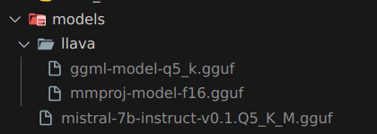

u need to download these models from hugging face and put them in models folder as shown in image  

[mistral-7b-instruct-v0.1.Q5_K_M.gguf](https://huggingface.co/TheBloke/Mistral-7B-Instruct-v0.1-GGUF/blob/main/mistral-7b-instruct-v0.1.Q5_K_M.gguf)  
[ggml-model-q5_k.gguf](https://huggingface.co/mys/ggml_llava-v1.5-7b/blob/main/ggml-model-q5_k.gguf)  
[models/llava/mmproj-model-f16.gguf](https://huggingface.co/mys/ggml_llava-v1.5-7b/blob/main/mmproj-model-f16.gguf)  

